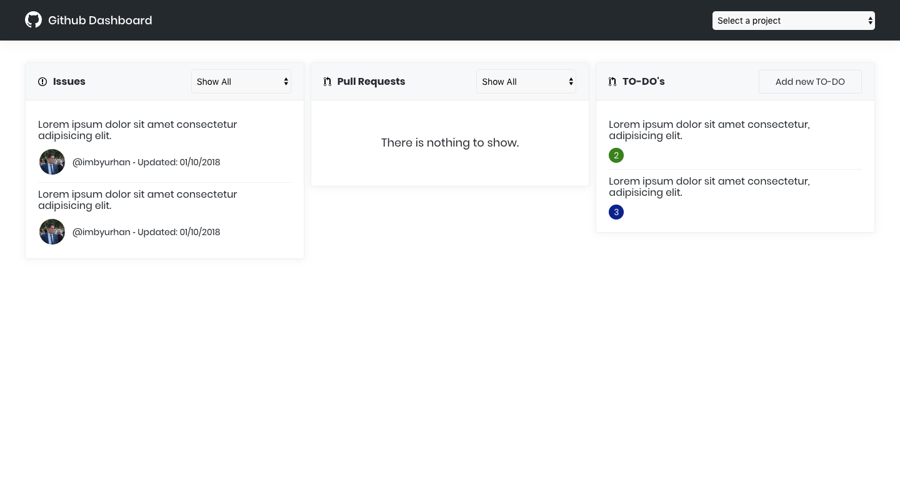

# Github Deck

Github Deck is a new tab extension for browser, where users can log in with GitHub access token and see their tasks.

This is what it will looks like

- Issues
  - Assigned by me
  - Assigned to me

- Pull Requests
  - Assigned by me
  - Assigned to me

- Todo list

May be will usefull if last deck/list can be customised by user or integration with Trello API.

[Repo](https://github.com/byurhanbeyzat/github-deck)